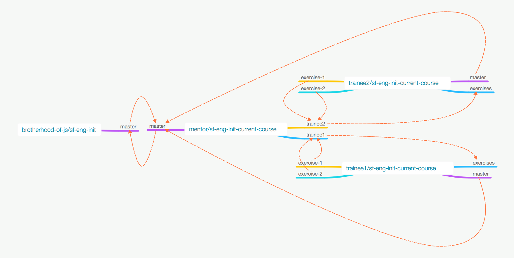

# Our Model of Collaboration

**[<= Back](../05-git-and-github/tools-for-development.md)**		*	*	*	**[Next =>](../../01-syntax/00-intro/intro.md)**

## Theory

1. [Github flow model](https://guides.github.com/introduction/flow/)
1. [Contributing to Open Source on GitHub](https://guides.github.com/activities/contributing-to-open-source/)
1. [Closing issues via commit messages](https://help.github.com/articles/closing-issues-via-commit-messages/)

## Idea

Setup such model of collaboration which would allow constant evolution and improvements of
learning content, tools and processes.

## Technical Details

Follow  open-source like model of collaboration, try to benefit from github flow,
but with some exceptions

### Trainee to Mentor

1. Trainees are doing exercises in their forks and create pull requests to mentor for review
    * [task is completed](http://c2.com/cgi/wiki?TaskCompleteDefinition) only if mentor merged it to his repository and closed corresponding issue
1. Trainee merges his completed tasks from mentor's repo after each milestone
1. Trainees may contribute to learning program by providing pull request to mentor's master branch

### Mentor to Trainee

1. Mentor provides updates in course content
1. Mentor provides additional exercises ontent and send pull requests to trainees repos

## Collaboration Diagram

## Practice

### Workshop: Contribute to Open Source 

[How to Contribute to an Open Source Project on GitHub](https://egghead.io/series/how-to-contribute-to-an-open-source-project-on-github)

### Exercise: Send your code

* Make sure that you have branch `exercises`
* Write a program which would print `Hello, World!` in a console, file for code [here](./helloWorld.js) 
* Create pull request to branch with name like your github nick
* Make sure that issue is wired with your pull request
* Make sure that in our board you have issue+pull-request as a one item

### Exercise: Contribute to Course content

> You shouldn't create separate issue for that exercise, creating pull request with good name would be enough 

* Try to find typos in content (there are a lot of them), broken links or provide additional content for course
* Create pull request to `master` branch

### Exercise: Merge mentor's pull request

Just merge mentor's pull request to your `exercise` branch

**[⬆ back to top](#our-model-of-collaboration)**

**[<= Back](../05-git-and-github/tools-for-development.md)**		*	*	*	**[Next =>](../../01-syntax/00-intro/intro.md)**

